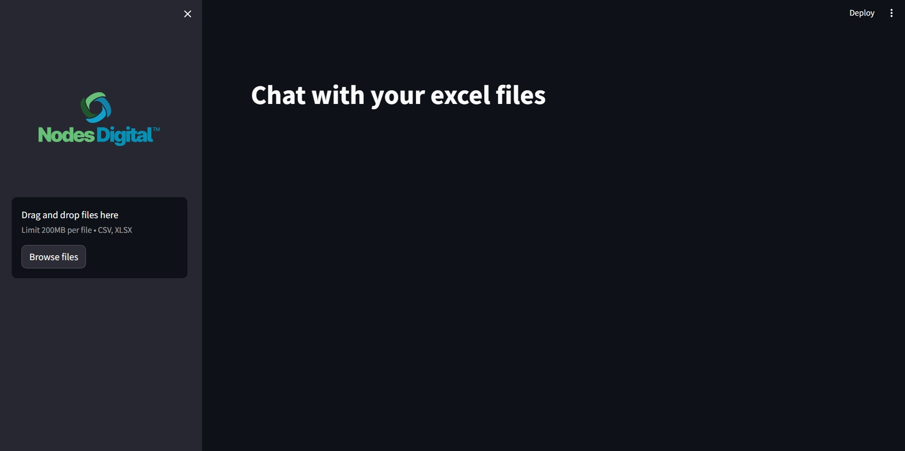
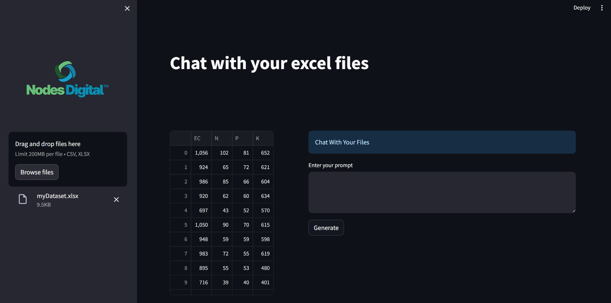
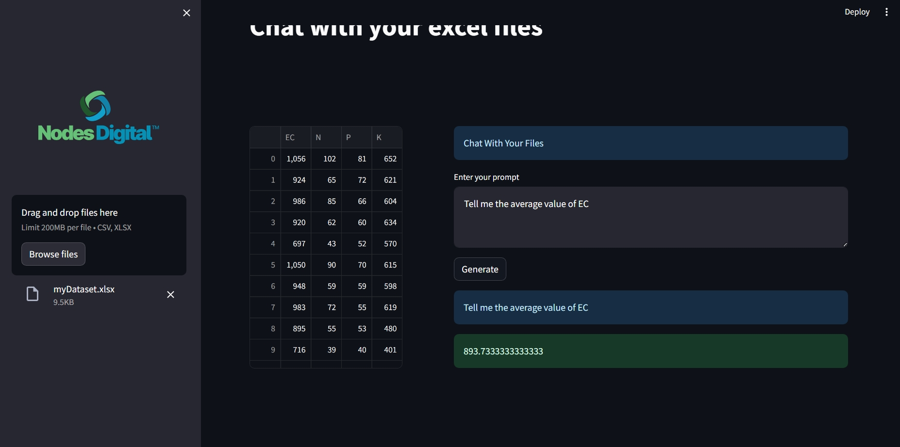
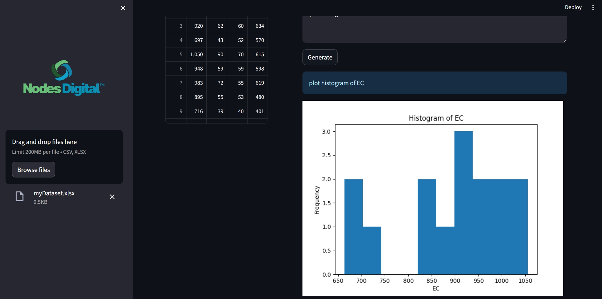
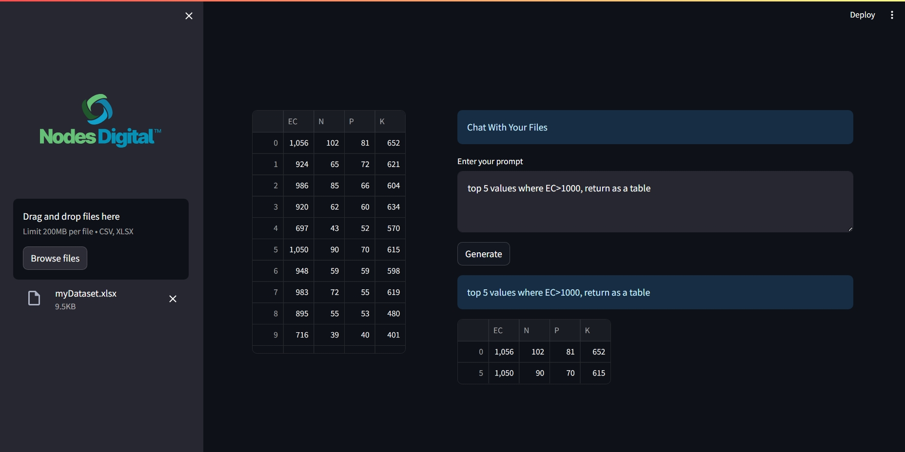

# Chat With Your Excel Files
This repository provides a comprehensive Streamlit application designed to enhance your interaction with Excel files. By leveraging the power of Streamlit, Pandas AI, Langchain Groq, LLAMA3 the application allows users to upload, view, and manipulate Excel files directly through a web interface, making data analysis more accessible and user-friendly. Whether you're a data analyst, a business professional, or simply someone who frequently works with Excel, this tool simplifies your workflow and provide powerful features to handle your data efficiently.

## Design  



 











## Getting Started

To get started with the application, follow these steps:

1. **Clone the Repository**: Begin by cloning the repository to your local machine using the following command:
   ```bash
   git clone https://github.com/yourusername/yourrepository.git
2. **Install Dependencies**: Navigate to the project directory and install the required dependencies.
   This can typically be done using pip:
   ```bash
   pip install -r requirements.txt
3. **Run the Application**: Start the Streamlit application by running the following command:
   ```bash
   streamlit run app.py


